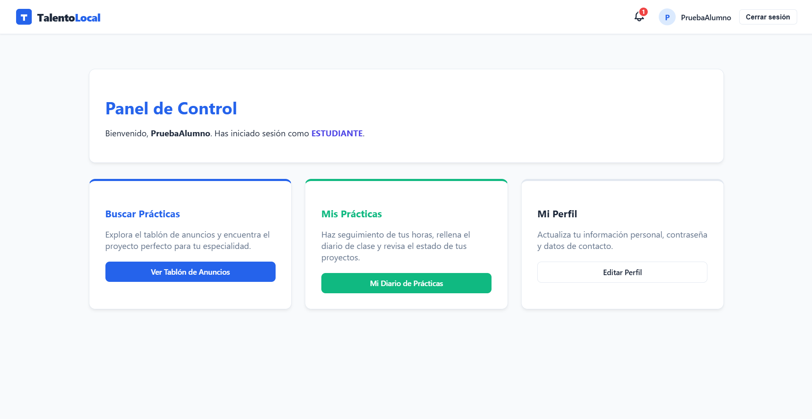
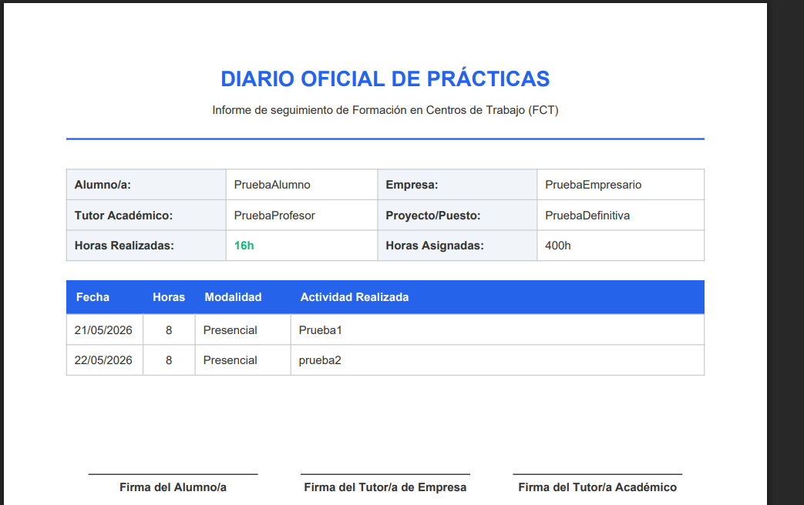
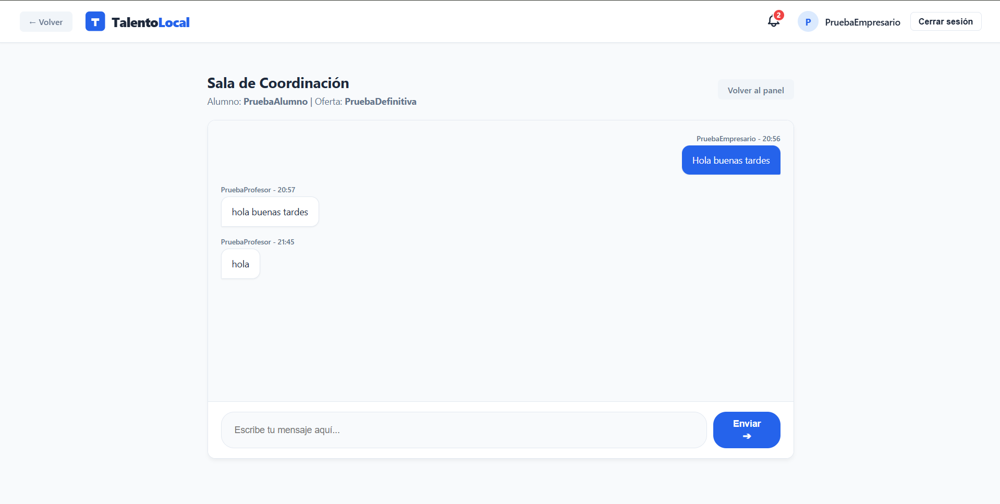

# 🚀 TalentoLocal - Plataforma de Gestión de Prácticas (FCT)

TalentoLocal es una aplicación web integral diseñada para revolucionar la gestión y el seguimiento de las prácticas en empresas (FCT). Conecta de manera eficiente a los tres pilares fundamentales de la formación profesional: **Estudiantes, Empresas y Tutores Académicos**.

## 🎯 Objetivos del Proyecto

* **Digitalización completa:** Eliminar el papeleo tradicional automatizando la generación del Diario Oficial de FCT en PDF.
* **Comunicación fluida:** Proporcionar canales directos y en tiempo real (salas de chat y notificaciones) entre tutores de institutos y tutores de empresa.
* **Autonomía del alumno:** Facilitar la búsqueda, postulación y el seguimiento del progreso de horas de forma visual y accesible.

## ⚙️ Características Principales

La plataforma cuenta con una arquitectura basada en roles (RBAC) que ofrece una experiencia personalizada para cada tipo de usuario:

* **👨‍🎓 Para Estudiantes:**
    * Exploración de ofertas de prácticas con buscador en tiempo real.
    * Inscripción directa a vacantes mediante subida de currículum en PDF/Word.
    * Generación automática y dinámica del **Diario de Prácticas Oficial en PDF** listo para imprimir y firmar.
* **🏢 Para Empresas:**
    * Panel de control para la publicación y gestión de ofertas de prácticas.
    * Revisión de candidaturas y descarga de currículums.
    * Chat integrado para la comunicación directa con los tutores académicos.
* **👨‍🏫 Para Tutores Académicos:**
    * Supervisión de los alumnos asignados.
    * Comunicación directa con las empresas para acordar las condiciones.
    * Activación del estado de las prácticas y validación de horas.

## 🛠️ Stack Tecnológico

Desarrollado con tecnologías modernas y estándares de la industria para garantizar escalabilidad, seguridad y una experiencia de usuario fluida:

* **Backend:** PHP, Laravel
* **Frontend:** JavaScript, CSS, Bootstrap, Blade Templating
* **Base de Datos:** MySQL
* **Arquitectura:** Patrón MVC (Modelo-Vista-Controlador)

## 🔔 Sistema de Notificaciones Inteligente

La plataforma incluye un motor de notificaciones dinámico. Las alertas en tiempo real se disparan y conectan a los usuarios de manera automatizada:
* Avisos a empresas cuando reciben nuevas candidaturas.
* Notificaciones cruzadas en el chat interno (Tutor ↔ Empresa) mediante AJAX Polling.
* Avisos a estudiantes cuando sus horas de prácticas son oficialmente activadas.

## 📸 Capturas de Pantalla


*Vista del dashboard principal y progreso de horas.*


*Sistema de registro de jornadas y descarga del documento oficial.*


*Sala de coordinación entre tutor académico y empresa.*

## 🚀 Instrucciones de Instalación y Despliegue Local

Sigue estos pasos para levantar el proyecto en tu entorno local:

1. **Clona el repositorio:**
   ```bash
   git clone [https://github.com/TuUsuario/talento-local-app.git](https://github.com/TuUsuario/talento-local-app.git)
   cd talento-local-app